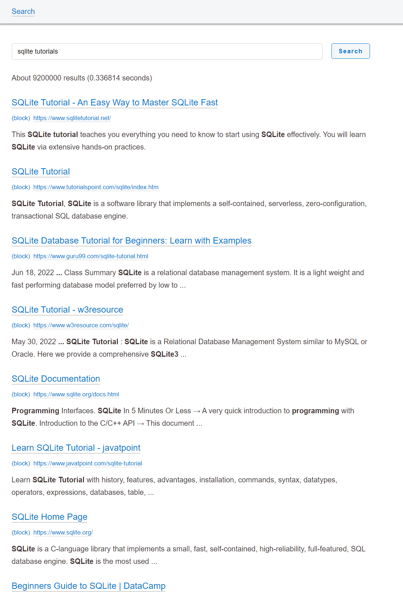

# Google search with exclusion list

This is a self-hosted app running locally that allows you to run your own Google search engine. The repo is setup to run locally on Windows. No need for Docker containers, no additional setup other than obtaining API keys from Google Programmable Search and Custom Search API (both are free).

# Features

- Block domains from appearing your search result
- No ads
- Customize the layout to your liking

# Limitations

- Limited to 10,000 searches a day
- Must setup with Google Programmable Search and custom Search API
- Currently setup to run on Windows

# How to setup

- Download a copy of the repo
- Under app, click dumbapp.exe
- Minimize the window that appears
- In your browser, goto http://127.0.0.1:62386/
- Make sure to get your CX and API key from google

# Example

